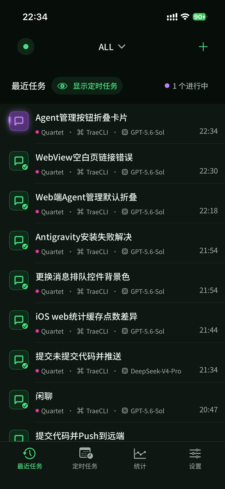
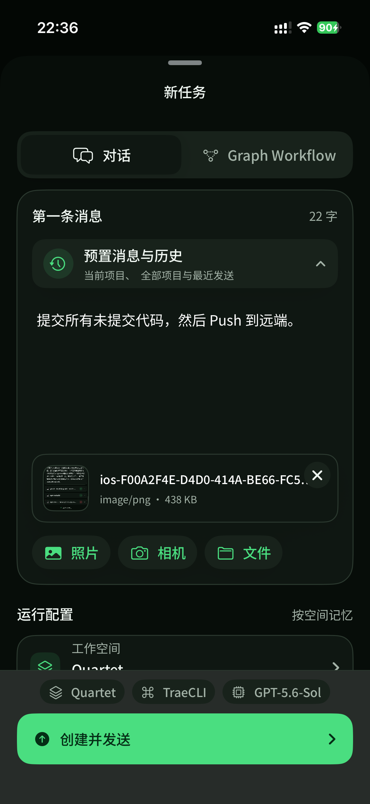
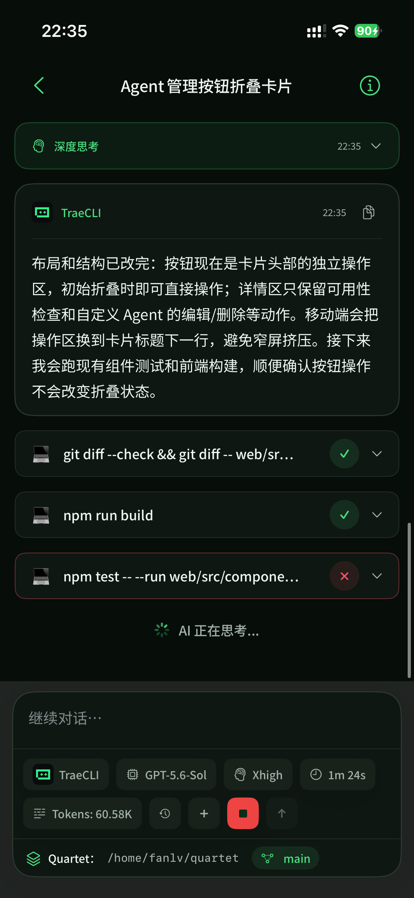
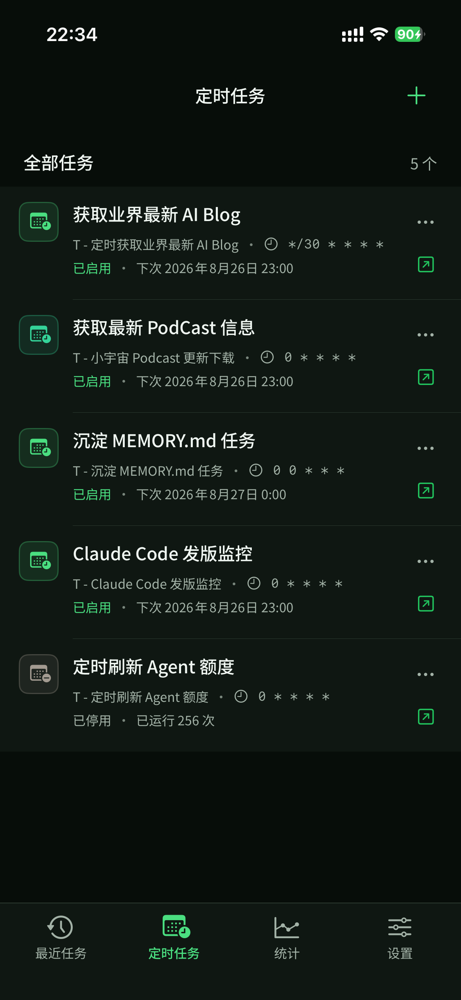
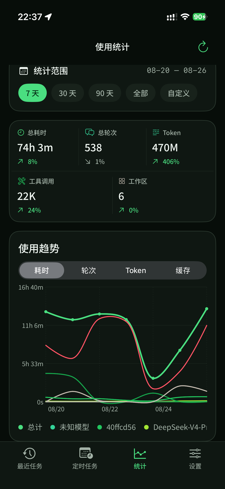
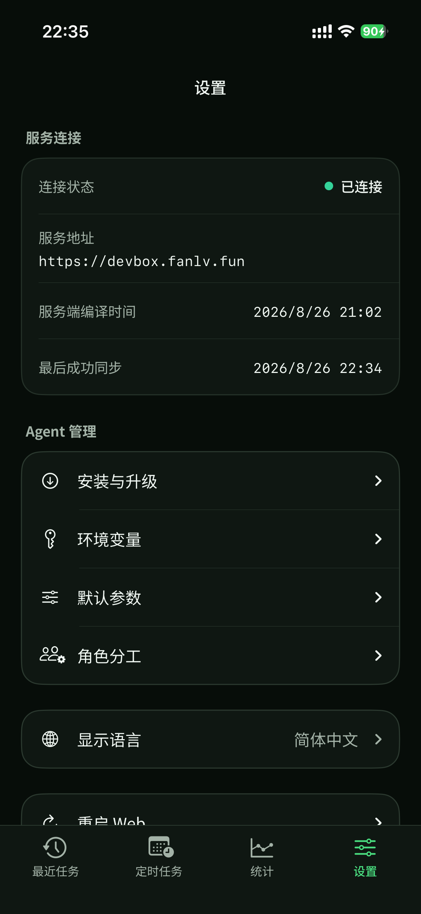
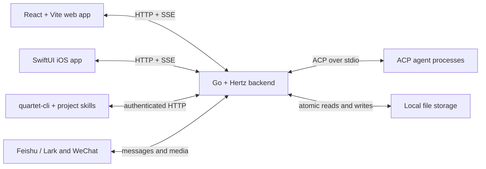

# Quartet

<p align="center">
  <strong>A local-first AI agent workbench for chat, visual workflows, and scheduled automation.</strong>
</p>

<p align="center">
  English | <a href="./README.zh-CN.md">简体中文</a>
</p>

Quartet brings the AI coding agents already installed on your machine into one
browser-based workspace. It uses the
[Agent Client Protocol (ACP)](https://agentclientprotocol.com/) as its agent
boundary, so the same UI can run interactive conversations, compose repeatable
multi-agent workflows, inspect live execution, and keep the resulting history
on local storage.

Quartet is designed for a trusted shared instance running on a personal computer
or in a development sandbox. Multiple login accounts share the same workspaces
and data while roles control available capabilities. It is under active
development, and its APIs and stored data formats may change before a stable
release.

## Highlights

- **One interface for multiple agents** - maintains a catalog of built-in and
  custom ACP agents, probes their models and modes, and lets you switch agent,
  model, mode, and reasoning level from the conversation.
- **Managed agent lifecycle** - checks availability and versions and can run
  the catalog's explicit install, upgrade, and uninstall flows from Web or iOS.
- **Interactive agent sessions** - streams answers, thoughts, tool calls,
  images, and errors in real time; preserves session history and supports
  stopping, resuming, renaming, pinning, and sharing jobs. Follow-up messages
  sent while a job is running enter a durable queue shared by Web and iOS.
- **Workspace-aware execution** - organizes jobs around project directories,
  remembers per-workspace defaults, exposes files to the conversation, and
  shows the active Git branch.
- **Visual graph workflows** - connects Prompt, Clarify, Shell, If/Else, and
  Loop nodes on a canvas, with variables, concurrency controls, validation,
  hooks, live progress, and resumable human-in-the-loop steps.
- **Scheduled automation** - runs graph workflows from cron expressions with
  enable/disable controls, timeouts, concurrency limits, manual triggering, and
  links to the latest run.
- **Local persistence and observability** - stores workspaces, jobs, sessions,
  workflows, schedules, and usage statistics as local files; includes usage
  views by workspace, model, tool, and time range, plus daily token details and
  provider-reported cache hit rates.
- **Messaging integrations** - can receive and reply to tasks through
  Feishu/Lark and personal WeChat after they are configured in Settings.
- **Native iOS client** - Sophia, the SwiftUI app in `ios/`, talks to the same
  backend over your LAN for conversations, attachments, graph runs, scheduled
  tasks, and usage statistics.
- **Agent-operated automation** - ships `quartet-cli` plus workflow, schedule,
  and WeChat skills, so compatible coding agents can manage automation without
  modifying workflows authored by the user.

## Screenshots

### Home and workspaces


### Agent conversation


### Visual workflow editor


### Usage statistics


### Settings


### iOS client (Sophia)

| Recent tasks | New task |
|---|---|
|  |  |

| Agent conversation | Scheduled tasks |
|---|---|
|  |  |

| Usage statistics | Settings |
|---|---|
|  |  |

## Graph Workflows

Graph Workflows turn repeatable work into visual, executable processes instead
of relying on one long prompt. A workflow is saved independently, can be bound
to a workspace and working directory, and can be started manually or by a
scheduled task.

### Compose multi-agent processes

- **Prompt nodes** run an ACP agent with a selected model, mode, and reasoning
  level. Each node can start a new session or inherit context from an upstream
  agent session.
- **Clarify nodes** deliberately pause the workflow for human discussion. You
  can continue chatting in the node's session and resume the graph after the
  decision is ready.
- **Shell nodes** run project commands alongside agent work, making it possible
  to combine analysis with builds, tests, linters, scripts, or deployment
  steps.
- **If/Else nodes** route execution from variable-based conditions, while
  **Loop nodes** repeat a nested subgraph for a fixed count or until a condition
  is met.
- Graph branches can fan out and run concurrently, then join again. Workflow
  settings control concurrency, node and job timeouts, loop limits, and the
  maximum number of generated instances.

Variables carry structured results between nodes. Prompt and Shell nodes can
publish named outputs for downstream prompts, conditions, and scripts. Before a
workflow is saved or run, Quartet validates its topology, conditions, variable
references, parallel writes, and unsafe concurrent session reuse, and reports
all detected problems together.

### Observe, control, and recover runs

- The canvas shows live node and edge states while each agent's conversation,
  reasoning, tool calls, command output, duration, and full error details remain
  available from the run.
- You can stop a run immediately, request a stop at the next step boundary, or
  cancel a pending step-stop.
- Failed, timed-out, interrupted, and step-stopped runs retain resumable state.
  Continuing a run preserves completed work and retries the unfinished portion,
  including the active round of nested loops.
- An active or resumable run can receive a new workflow version. Nodes that have
  not started use the new version, while running and completed nodes retain the
  configuration they actually executed.
- Per-node and end-of-run hooks can send notifications, record external status,
  or trigger follow-up scripts without changing the workflow result.

This makes Graph Workflows suitable for multi-agent code review, plan/implement/
verify pipelines, research with approval gates, repeated batch processing, and
other tasks that need more control and visibility than a single chat session.

### Code review demo

[`docs/demo/review-demo.json`](./docs/demo/review-demo.json) is a reusable
multi-agent code review workflow. It alternates between two primary reviewers,
asks the selected reviewer to double-check every finding, optionally sends the
surviving issue list to another agent for adversarial verification, and then
uses the inherited session to fix confirmed problems. Nested loops repeat the
review and repair cycle so the result can converge over multiple passes.

The demo is a portable graph config and does not contain a machine-specific
workspace ID or absolute path. Before running it, select your own workspace,
adjust the `Code`, `Doc`, `MultiWorker`, `AgentCheck`, and `Notice` variables,
and update the agent and model settings to match the ACP agents available on
your machine. You can also validate and add it to the agent-managed workflow
library with:

```bash
quartet-cli workflow validate --config-file docs/demo/review-demo.json
quartet-cli workflow create --name "Code Review" \
  --description "Iterative multi-agent review, verification, and repair" \
  --config-file docs/demo/review-demo.json
```

## Scheduled Tasks

Scheduled Tasks run saved Graph Workflows automatically from standard
five-field cron expressions. A schedule references a workflow rather than
copying it, so every future trigger reads the latest saved workflow
configuration.

- Choose the workflow, schedule name, cron expression, and optional workspace
  binding. An unbound schedule runs in the default workspace.
- Enable or disable a schedule without deleting it, and use **Run now** to test
  the same execution path immediately.
- Set a maximum number of concurrent runs to prevent unwanted overlap, plus an
  optional timeout for each scheduled execution.
- See the next trigger time, latest run time, latest status, run count, and the
  complete trigger error when a run could not be started.
- Open the latest generated Job directly to inspect the graph, agent sessions,
  tool activity, output, and errors just like a manually started run.

The scheduler runs inside the Quartet backend. Keep the backend running for
scheduled automation; `make web-watch` can monitor the service and revive it
when its port goes down.

## iOS Client

[`ios/`](./ios) contains **Sophia**, a native SwiftUI client for the same
backend. It targets personal use over a LAN: no agent runs on the phone, and the
app never reaches the host filesystem directly. Every capability goes through
the same authenticated HTTP and SSE APIs the web UI uses, so both clients see one
shared set of workspaces, jobs, and sessions.

- **Connect and sign in** - point the app at one Quartet address and log in with
  a Quartet username and password. Health and session checks run before the
  dashboard opens, a plaintext `http://` endpoint requires explicit
  confirmation, the password is never stored on the device, and role
  permissions decide which actions appear.
- **Recent tasks** - a paginated job list with workspace filter, pin, rename,
  delete, and stop actions, plus a toggle that hides or reveals
  schedule-generated runs. Workspace and job summaries are cached, so the list
  still opens when the backend is unreachable and marks itself as out of date.
- **Agent conversations** - start a conversation by choosing workspace, agent,
  model, mode, and reasoning level, or continue an existing one. Answers,
  thoughts, tool calls, images, Markdown, tables, and individually copyable code
  blocks stream in over SSE, with token totals, elapsed time, and the active
  working directory and Git branch in the composer. Messages sent while an
  agent is busy remain in the server-backed queue across app restarts and stay
  synchronized with the Web client.
- **Attachments** - send photos, camera captures, and image files from the
  system picker; oversized images are compressed before upload.
- **Presets and history** - reuse message presets scoped to the current
  workspace, presets shared across all workspaces, and recently sent messages.
- **Graph workflows** - launch a saved workflow after reviewing and overriding
  its workspace, global run limits, initial variables, and per-node Prompt,
  Shell, Clarify, and If/Else settings. The run view shows progress, the
  execution trace, per-node agent sessions and shell output, and supports stop,
  stop after the current step, cancel a pending stop, resume, and completing a
  clarify discussion.
- **Scheduled tasks** - create, edit, enable, disable, delete, and manually
  trigger cron schedules bound to saved workflows, with next run time, run
  count, latest status, and the complete trigger error.
- **Usage statistics** - 7/30/90-day, all-time, and custom ranges with totals,
  duration, turns, daily token details, provider-reported cache hit rates, and
  rankings by workspace, model, and tool.
- **Agent management** - inspect built-in and custom agents, check availability
  and versions, run supported install/upgrade/uninstall flows, and configure
  environment variables, defaults, favorite models, and role-specific agents.
- **Connection management** - inspect the active endpoint and last successful
  sync, restart the web service, reconfigure the connection, or sign out and
  clear it.
- **Background behavior** - event streams stop when the app is backgrounded and
  the server snapshot is re-read on return, so the UI does not silently display
  stale progress.

API errors keep the request method, URL, HTTP status, and full response body,
and can be copied out of the app.

Building requires macOS with Xcode 26 or newer, an iOS 26 or newer target, and
CocoaPods 1.15 or newer:

```bash
make pod-install   # install or refresh CocoaPods dependencies and the workspace
make build-ios     # build the device Debug configuration
make test-ios      # build the Simulator target without signing
make e2e-ios       # run the native XCUITest end-to-end suite in Simulator
```

Open `ios/Quartet.xcworkspace` rather than `ios/Quartet.xcodeproj`, select a
signing team, and run. [`ios/README.md`](./ios/README.md) documents the current
scope and verification boundaries in more detail.

## Agent Support

Quartet includes the source for **Eino**, a standalone ACP agent that can be
configured with Ark, OpenAI-compatible, Claude, DeepSeek, Gemini, Ollama, and
Qwen model providers.

Quartet's built-in catalog currently supports the following ACP CLIs. The Agent
management page can install, upgrade, uninstall, and validate entries whose
catalog definitions provide those operations; custom ACP launch definitions can
be added alongside them.

| Agent | Required CLI | ACP command used by Quartet | ACP setup |
|---|---|---|---|
| Eino | `eino-cli` | `eino-cli acp` | Build and install from this repository with `make build-eino-cli` |
| TraeCLI | `traex` | `traex acp serve` | Provided by the CLI |
| Grok | `grok` | `grok --no-auto-update agent stdio` | Provided by the CLI |
| OpenClaw | `openclaw` | `openclaw acp` | Provided by the CLI |
| Claude Code | `claude` | `claude-agent-acp` | **Requires the separate `@agentclientprotocol/claude-agent-acp` package** |
| Antigravity | `agy` | `antigravity-acp` | Automatically installs the required `antigravity-acp` package and Bun |
| Cursor | `cursor-agent` | `cursor-agent acp` | Provided by the CLI |
| GitHub Copilot | `copilot` | `copilot --acp --stdio` | Provided by the CLI |
| Droid | `droid` | `droid exec --output-format acp` | Provided by the CLI |
| Kimi | `kimi` | `kimi acp` | Provided by the CLI |
| Codex | `codex` | `codex-acp` | **Requires the separate `@agentclientprotocol/codex-acp` package** |
| Kiro | `kiro-cli` | `kiro-cli acp` | Provided by the CLI |
| OpenCode | `opencode` | `opencode acp` | Provided by the CLI |
| KiloCode | `kilocode` | `kilocode acp` | Installable from the Agent catalog through npm |
| QCode | `qoderclicn` | `qoderclicn --acp` | Provided by the CLI |

External tools, accounts, subscriptions, and authentication remain managed by
their respective vendors.

You only need one working agent to start chatting. Unsupported or unavailable
agents are skipped without preventing the rest of the application from loading.

## Quick Start

### Prerequisites

- Go `1.25` or newer
- Node.js `>=22.18.0 <23`
- npm `>=10.9.0 <11`
- Git, GNU Make, Bash, and common Unix tools such as `lsof`
- Credentials for at least one supported ACP agent; its CLI can be installed
  before startup or later from **Settings > Agents**

The current build and service scripts target Linux and other Unix-like
environments.

### 1. Clone and configure local storage

```bash
git clone https://github.com/fanlv/quartet.git
cd quartet

export LOCAL_MEMORY="$HOME/.quartet-memory"
mkdir -p "$LOCAL_MEMORY"
```

`LOCAL_MEMORY` must be an absolute path. Quartet uses it as the root for its
persistent configuration, jobs, sessions, workflows, schedules, uploads, and
usage statistics.

### 2. Build and start Quartet

```bash
make web
```

On a normal source checkout, Quartet serves the built UI and API from a single
backend process at:

```text
http://127.0.0.1:8090
```

`make web` builds the frontend and backend, starts the backend as a detached
process, and writes logs to `/tmp/quartet-backend.log`.

### 3. Open the UI

On first launch, create the administrator account; later visits require a
Quartet login. Create or select a workspace, choose an available agent and
model, then send a message. Agent installation, environment variables, favorite
models, defaults, and role-specific agents are managed under
**Settings > Agents**.

## External ACP Agents

The easiest setup path is **Settings > Agents > Install & Upgrade**, which shows
the exact catalog-defined commands before running them and retains complete
results. You can also install and authenticate an external agent manually; in
that case, ensure its CLI and ACP adapter are available on the same `PATH` used
to start Quartet, then restart the backend.

Claude Code and Codex do not expose the ACP commands used by Quartet through
their main CLI packages alone. After installing the `claude` or `codex` CLI,
install the corresponding ACP adapter separately:

```bash
npm install -g @agentclientprotocol/claude-agent-acp
npm install -g @agentclientprotocol/codex-acp
```

Quartet requires both `claude` and `claude-agent-acp` for Claude Code, and both
`codex` and `codex-acp` for Codex, to resolve from the backend's `PATH`.

## Service Commands

| Command | Description |
|---|---|
| `make web` | Build the UI and backend, then start or restart the detached web service |
| `make web-status` | Show backend and watchdog status |
| `make web-logs` | Follow `/tmp/quartet-backend.log` |
| `make web-stop` | Stop the backend and clean up orphaned `quartet-web` processes |
| `make backend-stop` | Stop only the backend and leave the watchdog running |
| `make web-watch` | Start a detached watchdog that revives the backend if its port goes down |
| `make web-watch-stop` | Stop the watchdog without stopping the backend |
| `make web-watch-logs` | Follow `/tmp/quartet-watchdog.log` |
| `make build-frontend` | Rebuild the SPA into `static/` without restarting the backend |
| `make build-cli` | Build `bin/quartet-cli` |
| `make build-eino-cli` | Build and install the standalone Eino ACP agent |
| `make install-project-tools` | Install `quartet-cli` and all project skills |
| `make build-ios` | Build the iOS app on macOS with Xcode |
| `make test-ios` | Build the iOS app for Simulator without signing |
| `make pod-install` | Install or refresh the iOS CocoaPods dependencies |
| `make e2e-ios` | Run the native iOS UI tests in Simulator |

## Configuration

| Variable | Required | Description |
|---|---:|---|
| `LOCAL_MEMORY` | Yes | Absolute path used for Quartet's persistent data and runtime state |
| `QUARTET_LISTEN_ADDR` | No | Overrides the default listen address |
| `QUARTET_CORS_ORIGINS` | No | Comma-separated cross-origin allowlist; unset means same-origin only |
| `QUARTET_TRUSTED_PROXIES` | No | Comma-separated reverse-proxy IPs/CIDRs trusted to supply client-IP headers; defaults to loopback only; use `none` to disable |
| `QUARTET_LOG_LEVEL` | No | Initial log level: `debug`, `info`, `warn`, or `error` |
| `QUARTET_STATIC_DIR` | No | Built frontend directory; defaults to `static` |
| `QUARTET_CERTS_DIR` | No | Directory containing `cert.pem` and `key.pem`; defaults to `certs` |

Without certificates, Quartet binds to `0.0.0.0:8090` over HTTP. When both
`cert.pem` and `key.pem` exist in the certificate directory, it enables HTTPS
and defaults to `0.0.0.0:443`; it also exposes a loopback-only plaintext
listener at `127.0.0.1:8090` for `quartet-cli` and local workflow scripts.
`QUARTET_LISTEN_ADDR` overrides the backend address but does not change whether
certificate-based TLS is enabled.

Quartet always protects private APIs with user login sessions. On first start,
use the Web setup page to create the first administrator. Administrators can
then create users and assign roles. Web, iOS, and `quartet-cli` all authenticate
with cookies; there is no shared API token. See the
[permissions and access-control documentation](docs/arch/permissions/README.md)
for the complete boundary.

## Data and Privacy

Quartet's own state is file-based and local:

```text
$LOCAL_MEMORY/
├── quartet/
│   ├── config/       # auth, prompts, workflows, schedules, and message presets
│   ├── data/         # settings, Agent catalog, workspaces, jobs, uploads, IM, and shares
│   └── usage-stats/  # month-sharded usage statistics
└── var/quartet/
    ├── state/        # sessions, schedule state, and sandbox state
    ├── cache/        # reconstructable caches
    └── tmp/          # process-owned temporary files
```

Writes to important records are atomic. Backing up `LOCAL_MEMORY` backs up the
complete state of the Quartet instance. Login accounts share its workspaces and
business data; roles control capabilities rather than providing data isolation.

Messages and files are still sent to whichever agent and model provider you
select. Review that provider's privacy policy and the permissions granted to
its local CLI.

## Architecture



HTTP handlers validate and authorize requests, business services own behavior,
repositories own persistence, and `types/path` owns the storage layout. All
agents, including Eino, enter through the same ACP session and event pipeline.

| Path | Purpose |
|---|---|
| `cmd/web` | Web server, API routes, middleware, and application assembly |
| `cmd/quartet-cli` | Authenticated workflow, schedule, workspace, job, agent, and WeChat CLI |
| `cmd/eino-cli`, `einocli` | Bundled standalone Eino ACP agent |
| `types/model` | Shared request, response, and domain models |
| `types/path` | Canonical paths for configuration, business data, and runtime state |
| `repository` | Local persistence |
| `services` | Auth, agent, job, graph, schedule, workspace, IM, skills, and statistics behavior |
| `pkg` | ACP, messaging, sandbox, logging, and common infrastructure |
| `web` | React frontend |
| `ios` | Native SwiftUI client (Sophia) for personal LAN use |
| `skill` | Workflow, schedule, and WeChat skills driven by `quartet-cli` |

## CLI and Project Skills

Install `quartet-cli` and all three project skills for supported coding agents:

```bash
make install-project-tools
```

The command installs `quartet-cli` to `~/.local/bin` by default and registers:

- `quartet-workflow` for creating, inspecting, validating, updating, deleting,
  and running workflows in the agent-managed library. User-authored workflows
  remain read-only to the CLI.
- `quartet-schedule` for creating and operating cron schedules backed by saved
  Graph Workflows.
- `quartet-wechat` for listing connected iLink accounts and sending proactive
  text messages through the durable WeChat outbox.

The CLI also lists workspaces and installed agents and can inspect or stop Jobs.
To install only one project skill, set its name explicitly:

```bash
make install-skill SKILL_NAME=quartet-workflow
```

`quartet-schedule` and `quartet-wechat` are the other valid project skill names.

## Development

```bash
make build-all       # Build all Go applications
make build-cli       # Build quartet-cli
make build-eino-cli  # Build and install the standalone Eino ACP agent
make build-frontend  # Type-check and build the React application
make test-ios        # Build the iOS Simulator target on macOS without signing
make e2e-ios         # Run native iOS UI tests in Simulator
make test-web        # Run frontend component tests
make e2e             # Run Playwright end-to-end tests
make test            # Run Go build, frontend tests, and E2E tests
go test ./...        # Run Go tests
```

Frontend-only commands are available from `web/`:

```bash
npm run dev
npm run build
npm run lint
npm test
```

## Contributing

Issues and pull requests are welcome. Before submitting a change, keep behavior
within the existing service boundaries and run the checks relevant to the code
you changed.

## License

Quartet is licensed under the [Apache License 2.0](LICENSE).
