# Quartet

<p align="center">
  <strong>本地优先的 AI Agent 工作台，覆盖对话、可视化工作流与定时自动化。</strong>
</p>

<p align="center">
  <a href="./README.md">English</a> | 简体中文
</p>

Quartet 将电脑上已经安装的 AI 编程 Agent 汇集到一个浏览器工作台中。它以
[Agent Client Protocol（ACP）](https://agentclientprotocol.com/)作为统一接入边界，
让你可以在同一套界面中进行交互式对话、编排可复用的多 Agent 工作流、观察实时执行过程，
并将任务历史保存在本地。

Quartet 面向在个人电脑或开发沙箱中运行的可信共享实例。多个登录账号共享同一套工作区和
业务数据，并通过角色限制可用能力。项目目前仍在快速开发中，在稳定版本发布前，API 和本地
数据格式可能会发生变化。

## 核心功能

- **统一接入多个 Agent**：自动发现 `PATH` 中受支持的 ACP Agent，探测可用模型和模式，
  并支持在对话中切换 Agent、模型、运行模式和思考等级。
- **实时 Agent 对话**：实时展示回答、思考过程、工具调用、图片和完整错误信息；保存会话历史，
  支持停止、恢复、重命名、置顶和只读分享任务。
- **面向项目的工作区**：以项目目录组织任务，记忆每个工作区的默认配置，在对话中使用文件，
  并展示当前 Git 分支。
- **可视化 Graph 工作流**：通过画布连接 Prompt、Clarify、Shell、If/Else 和 Loop 节点，
  支持变量、并发控制、静态校验、Hook、实时进度以及可恢复的人工确认步骤。
- **定时自动化**：使用 Cron 表达式运行 Graph 工作流，支持启停、超时、并发上限、立即运行，
  并可跳转到最近一次任务。
- **本地持久化与统计**：将工作区、任务、会话、工作流、定时任务和用量统计保存为本地文件；
  可按工作区、模型、工具和时间范围查看使用情况。
- **即时通讯接入**：在设置中完成配置后，可通过飞书/Lark 和个人微信接收任务并回复结果。
- **原生 iOS 客户端**：`ios/` 下的 SwiftUI 应用 Sophia 在局域网内连接同一个后端，支持对话、
  附件、Graph 运行、定时任务和用量统计。
- **可由 Agent 扩展的工作流**：内置 `quartet-cli` 和 `quartet-workflow` Skill，让兼容的
  编程 Agent 创建和校验工作流，同时避免修改用户手工编排的工作流。

## 界面预览

### 首页与工作区

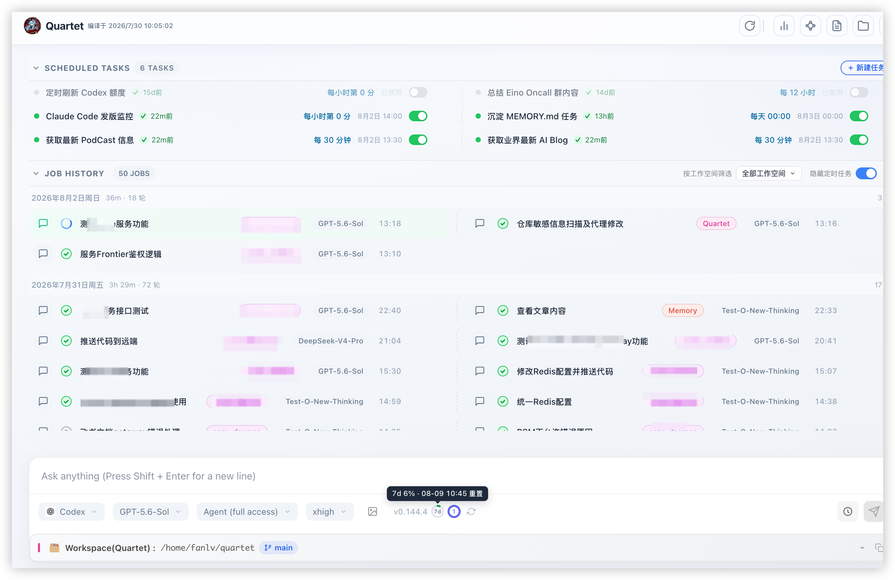

### Agent 对话

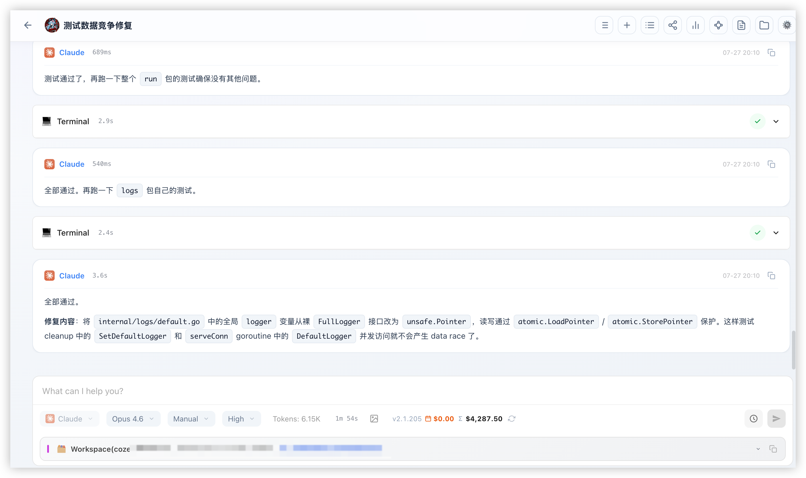

### 可视化工作流

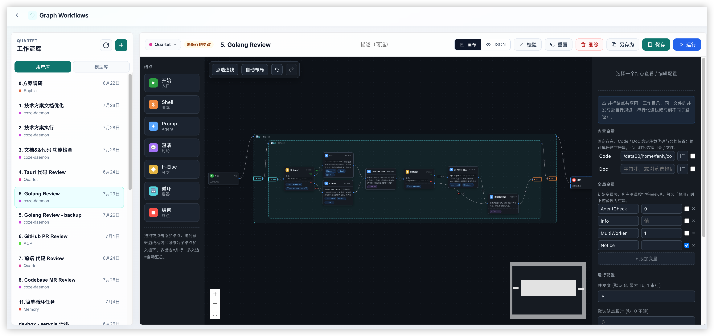

### 用量统计

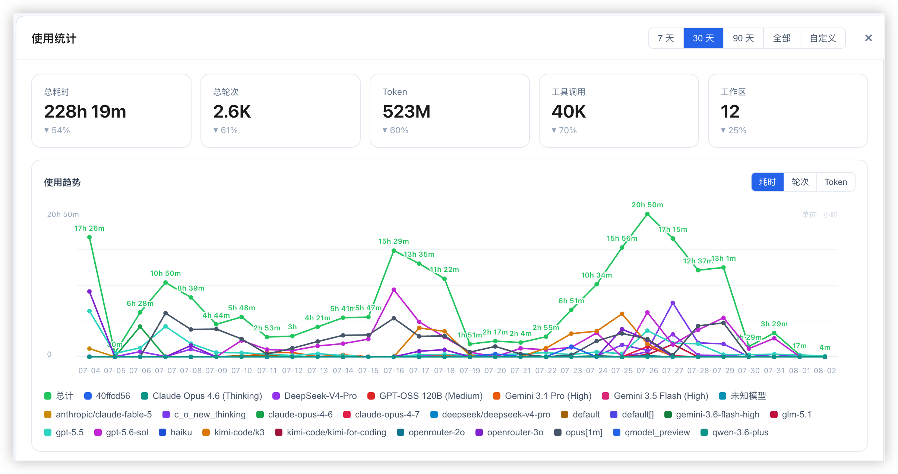

### 设置

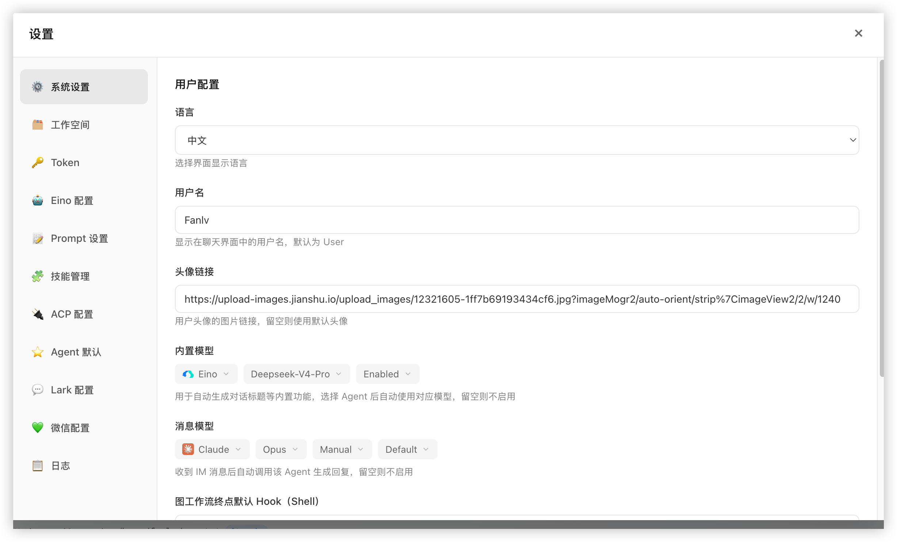

### iOS 客户端（Sophia）

| 最近任务 | Agent 对话 |
|---|---|
| 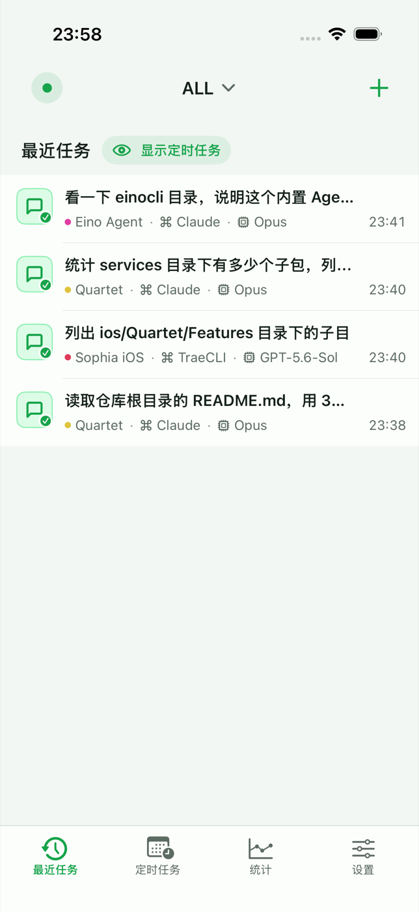 | 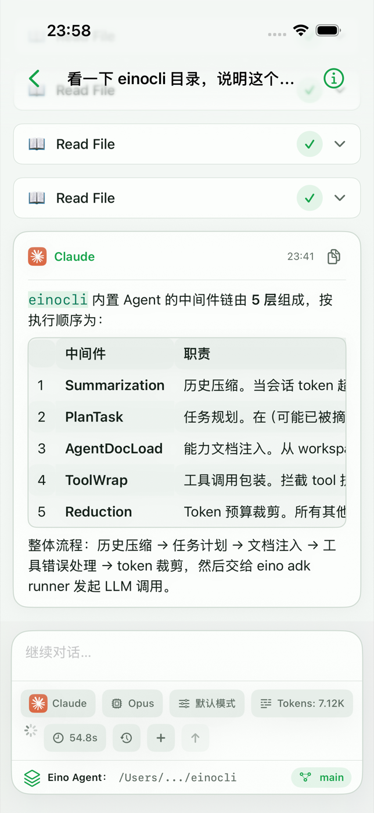 |

| 新任务 | Graph 运行 |
|---|---|
| 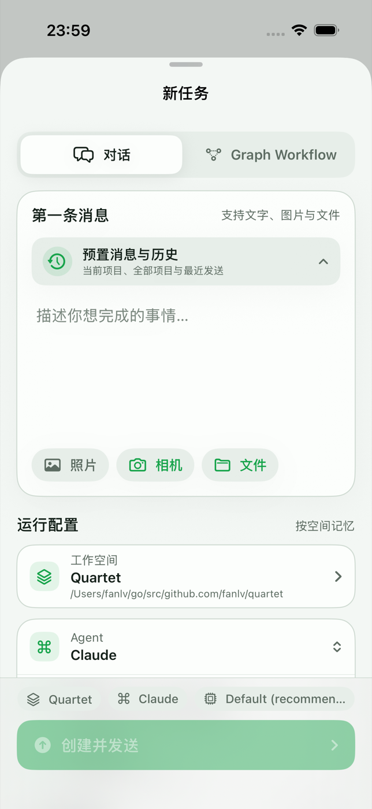 | 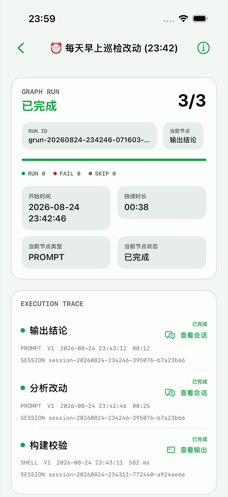 |

| 定时任务 | 用量统计 |
|---|---|
| 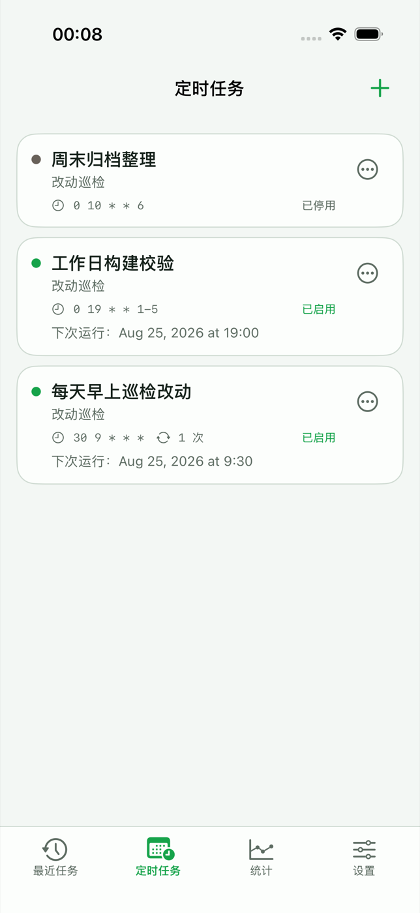 | 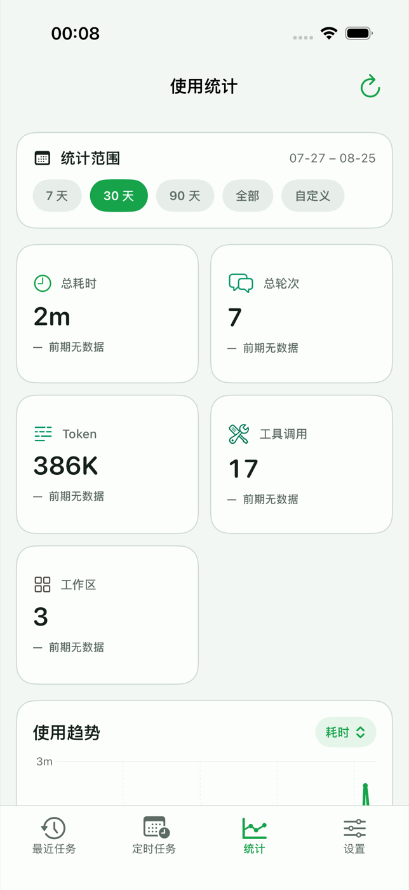 |

## Graph Workflow

Graph Workflow 将可重复的工作从一段超长 Prompt，变成可视化、可执行、可观察的流程。工作流
独立保存，可以绑定工作区和工作目录，既能手动启动，也能交给定时任务自动运行。

### 编排多 Agent 流程

- **Prompt 节点**通过指定的 ACP Agent、模型、模式和思考等级执行任务。每个节点可以创建
  新会话，也可以继承上游 Agent 会话的上下文。
- **Clarify 节点**会主动暂停工作流，等待人工讨论。你可以在该节点的会话中继续沟通，得出
  结论后再恢复后续流程。
- **Shell 节点**在 Agent 任务之间运行项目命令，因此可以把分析与构建、测试、Lint、脚本
  或部署步骤串在一起。
- **If/Else 节点**根据变量条件选择分支；**Loop 节点**可以按固定次数执行嵌套子图，也可以
  一直运行到满足指定条件。
- 流程可以分叉并发执行，再在下游汇合。工作流级配置可限制并发数、节点与任务超时、循环次数
  和运行时生成的节点实例总量。

节点之间通过变量传递结构化结果。Prompt 和 Shell 节点可以输出命名变量，供后续 Prompt、
条件判断和脚本使用。保存或运行前，Quartet 会一次性校验拓扑、条件表达式、变量引用、并行
写入冲突以及并发复用同一会话等问题，并完整展示所有校验错误。

### 观察、控制与恢复运行

- 画布实时展示节点和连线状态；每个 Agent 节点的对话、思考、工具调用、命令输出、耗时和
  完整错误信息都可以在运行记录中查看。
- 可以立即停止整个流程，也可以请求在当前步骤边界停止；尚未生效的分步停止还可以取消。
- 失败、超时、中断和分步停止的流程都会保留可恢复状态。继续运行时会保留已经完成的工作，
  只重试未完成部分，包括嵌套循环中正在执行的轮次。
- 正在运行或可恢复的流程可以应用新版本。尚未开始的节点使用新配置，运行中和已完成的节点
  仍保留它们实际执行时的版本。
- 节点 Hook 和结束 Hook 可用于发送通知、记录外部状态或触发后续脚本，并且不会改变工作流
  本身的执行结果。

Graph Workflow 适合多 Agent 代码审查、规划/实现/验证流水线、带人工审批的调研任务、重复
批处理，以及其他比单轮对话更需要控制力和可观察性的任务。

### Code Review 示例

[`docs/demo/review-demo.json`](./docs/demo/review-demo.json) 提供了一个可复用的多 Agent
代码审查工作流。流程会在两个主审 Agent 之间轮换，要求当前 Agent 逐项复核审查结果，可选
调用另一个 Agent 进行对抗验证，再复用原会话修复确认的问题。外层与内层循环会重复执行审查、
验证和修复，直到结果逐步收敛。

该示例是可移植的 Graph 配置，不包含本机工作区 ID 或个人绝对路径。运行前需要选择自己的
工作区，按需设置 `Code`、`Doc`、`MultiWorker`、`AgentCheck` 和 `Notice` 变量，并根据
本机可用的 ACP Agent 调整各节点的 Agent 与模型配置。也可以通过下面的命令校验配置，并将
它添加到 Agent 管理的工作流库：

```bash
quartet-cli workflow validate --config-file docs/demo/review-demo.json
quartet-cli workflow create --name "Code Review" \
  --description "多 Agent 迭代审查、验证与修复" \
  --config-file docs/demo/review-demo.json
```

## 定时任务

定时任务使用标准五段 Cron 表达式自动运行已经保存的 Graph Workflow。定时任务只保存
工作流引用，不复制工作流内容，因此后续每次触发都会读取该工作流的最新配置。

- 选择工作流、任务名称、Cron 表达式，并可按需绑定工作区；未绑定时在默认工作区运行。
- 可以单独启用或停用任务而不删除配置，也可以通过**立即运行**验证相同的执行链路。
- 可以设置最大并发运行数，防止任务发生非预期重叠，并为每次定时运行设置可选超时。
- 首页会展示下次触发时间、最近运行时间、最近状态和累计运行次数；如果任务启动失败，会保留
  完整触发错误。
- 可以直接打开最近一次生成的 Job，像手动运行一样查看 Graph、Agent 会话、工具调用、输出
  和错误。

调度器运行在 Quartet 后端进程中，因此定时自动化要求后端保持运行。可以使用
`make web-watch` 监控服务，并在端口不可用时自动拉起后端。

## iOS 客户端

[`ios/`](./ios) 目录是原生 SwiftUI 客户端 **Sophia**，连接同一个 Quartet 后端，面向个人在
局域网内使用：手机上不运行任何 Agent，也不直接访问后端机器的文件系统，所有能力都通过 Web 端
同样的登录态 HTTP 与 SSE 接口完成，因此两个客户端看到的是同一份工作区、任务和会话。

- **连接与登录**：配置一个 Quartet 服务地址，使用 Quartet 用户名和密码登录。进入主界面前
  会先做健康检查和会话校验；明文 `http://` 地址需要显式确认；密码不会保存在设备上；界面上
  出现哪些操作由角色权限决定。
- **最近任务**：分页任务列表，支持按工作区筛选，以及置顶、重命名、删除和停止；可以切换隐藏
  或显示由定时任务生成的运行。工作区与任务摘要有本地缓存，后端不可达时仍能打开列表并标记
  数据已过期。
- **Agent 对话**：新建对话时选择工作区、Agent、模型、运行模式和思考等级，也可以继续已有
  对话。回答、思考过程、工具调用、图片、Markdown、表格和可单独复制的代码块通过 SSE 实时
  展示，输入区同时显示 Token 累计、耗时、当前工作目录和 Git 分支。
- **附件**：支持发送照片、相机拍摄和系统文件选择器中的图片，过大的图片会在上传前压缩。
- **预置消息与历史**：可以复用当前工作区的预置消息、全部工作区共享的预置消息，以及最近
  发送过的内容。
- **Graph Workflow**：启动已保存的工作流前，可以查看并调整运行空间、全局执行限制、初始变量，
  以及 Prompt、Shell、澄清和条件节点的逐节点配置。运行页展示进度、执行轨迹、节点会话和
  Shell 输出，并支持停止、步骤后停止、取消停止、恢复运行和结束澄清讨论。
- **定时任务**：创建、编辑、启用、停用、删除和手动触发绑定工作流的 Cron 任务，展示下次运行
  时间、累计运行次数、最近状态和完整触发错误。
- **用量统计**：支持 7/30/90 天、全部和自定义范围，展示总览、趋势以及按工作区、模型和工具
  的排行。
- **连接管理**：查看当前服务地址和最后成功同步时间，重启 Web 服务、重新配置连接，或退出并
  清除连接。
- **后台行为**：应用进入后台后停止事件流，回到前台重新读取服务端快照，不会静默展示过期进度。

接口错误会保留请求方法、URL、HTTP 状态和完整响应正文，并支持在应用内复制。

构建需要 macOS、Xcode 26 或更新版本、iOS 26 或更新版本，以及 CocoaPods 1.15 或更新版本：

```bash
make pod-install   # 安装或同步 iOS CocoaPods 依赖与 workspace
make build-ios     # 构建真机 Debug 版本
make test-ios      # 无签名构建 iOS Simulator 版本
make e2e-ios       # 在模拟器运行原生 XCUITest 端到端测试
```

请打开 `ios/Quartet.xcworkspace`，不要直接打开 `ios/Quartet.xcodeproj`；选择签名团队后即可
运行。更详细的能力范围和验证边界见 [`ios/README.md`](./ios/README.md)。

## Agent 支持

Quartet 仓库内置 **Eino** 的源码。Eino 是一个独立 ACP Agent，可配置 Ark、OpenAI
兼容接口、Claude、DeepSeek、Gemini、Ollama 和 Qwen 等模型提供方。

Quartet 当前会从后端进程的 `PATH` 中发现以下 ACP CLI：

| Agent | 必需的 CLI | Quartet 使用的 ACP 命令 | ACP 接入方式 |
|---|---|---|---|
| Eino | `eino-cli` | `eino-cli acp` | 在本仓库执行 `make build-eino-cli` 构建并安装 |
| TraeCLI | `traex` | `traex acp serve` | CLI 内置 |
| Grok | `grok` | `grok --no-auto-update agent stdio` | CLI 内置 |
| OpenClaw | `openclaw` | `openclaw acp` | CLI 内置 |
| Claude Code | `claude` | `claude-agent-acp` | **需要额外安装 `@agentclientprotocol/claude-agent-acp` 包** |
| Antigravity | `agy` | `antigravity-acp` | 需要额外安装 `antigravity-acp` 包和 Bun |
| Cursor | `cursor-agent` | `cursor-agent acp` | CLI 内置 |
| GitHub Copilot | `copilot` | `copilot --acp --stdio` | CLI 内置 |
| Droid | `droid` | `droid exec --output-format acp` | CLI 内置 |
| Kimi | `kimi` | `kimi acp` | CLI 内置 |
| Codex | `codex` | `codex-acp` | **需要额外安装 `@agentclientprotocol/codex-acp` 包** |
| Kiro | `kiro-cli` | `kiro-cli acp` | CLI 内置 |
| OpenCode | `opencode` | `opencode acp` | CLI 内置 |
| KiloCode | `kilocode` | `npx -y @kilocode/cli acp` | 需要 Node.js 和 `npx` |
| QCode | `qoderclicn` | `qoderclicn --acp` | CLI 内置 |

外部工具的账号、订阅和认证仍由对应厂商的工具自行管理。

只要有一个可用 Agent 就能开始对话。某个 Agent 不可用或探测失败时，Quartet 会跳过它，
不会阻塞应用其余部分的加载。

## 快速开始

### 环境要求

- Go `1.25` 或更高版本
- Node.js `>=22.18.0 <23`
- npm `>=10.9.0 <11`
- Git、GNU Make、Bash，以及 `lsof` 等常用 Unix 工具
- 至少一个已经安装并登录的受支持 ACP Agent

当前构建和服务脚本主要面向 Linux 与其他类 Unix 环境。

### 1. 克隆仓库并配置本地存储

```bash
git clone https://github.com/fanlv/quartet.git
cd quartet

export LOCAL_MEMORY="$HOME/.quartet-memory"
mkdir -p "$LOCAL_MEMORY"
```

`LOCAL_MEMORY` 必须是绝对路径。Quartet 会以它作为持久化配置、任务、会话、工作流、
定时任务、上传文件和用量统计的根目录。

### 2. 构建并启动 Quartet

```bash
make web
```

在普通源码检出中，Quartet 由一个后端进程同时提供构建后的前端页面和 API，默认地址为：

```text
http://127.0.0.1:8090
```

`make web` 会构建前端和后端，以脱离终端的方式启动后端，并将日志写入
`/tmp/quartet-backend.log`。

### 3. 打开页面

创建或选择工作区，选择可用的 Agent 和模型，然后发送消息。Agent 专属环境变量和默认项可以
在 **设置 > ACP** 与 **设置 > Agent 默认值** 中管理。

## 外部 ACP Agent

请使用外部 Agent 的官方工具完成安装和登录，并确保 Agent CLI 及其 ACP 适配器都位于
启动 Quartet 时使用的同一个 `PATH` 中。修改 `PATH` 后需要重启后端。

Claude Code 和 Codex 的主 CLI 包本身不提供 Quartet 使用的 ACP 命令。安装 `claude` 或
`codex` CLI 后，还需要分别安装对应的 ACP 适配器：

```bash
npm install -g @agentclientprotocol/claude-agent-acp
npm install -g @agentclientprotocol/codex-acp
```

Claude Code 要求后端的 `PATH` 中同时能找到 `claude` 和 `claude-agent-acp`；Codex 要求
同时能找到 `codex` 和 `codex-acp`。

## 服务命令

| 命令 | 说明 |
|---|---|
| `make web` | 构建前端和后端，并启动或重启脱离终端运行的 Web 服务 |
| `make web-status` | 查看后端与 watchdog 状态 |
| `make web-logs` | 持续查看 `/tmp/quartet-backend.log` |
| `make web-stop` | 停止后端并清理游离的 `quartet-web` 进程 |
| `make web-watch` | 启动独立 watchdog，在端口不可用时拉起后端 |
| `make web-watch-stop` | 只停止 watchdog，不停止后端 |
| `make build-frontend` | 将 SPA 重新构建到 `static/`，不重启后端 |
| `make build-ios` | 在 macOS/Xcode 上构建 iOS 应用 |
| `make test-ios` | 无签名构建 iOS Simulator 目标 |
| `make pod-install` | 安装或同步 iOS CocoaPods 依赖 |
| `make e2e-ios` | 在模拟器运行原生 iOS UI 测试 |

## 配置

| 环境变量 | 必需 | 说明 |
|---|---:|---|
| `LOCAL_MEMORY` | 是 | Quartet 持久化数据和运行状态使用的绝对路径 |
| `QUARTET_LISTEN_ADDR` | 否 | 覆盖默认监听地址 |
| `QUARTET_CORS_ORIGINS` | 否 | 以逗号分隔的跨域来源白名单；未设置时仅允许同源 |
| `QUARTET_LOG_LEVEL` | 否 | 初始日志级别：`debug`、`info`、`warn` 或 `error` |
| `QUARTET_STATIC_DIR` | 否 | 构建后的前端目录，默认为 `static` |
| `QUARTET_CERTS_DIR` | 否 | 存放 `cert.pem` 和 `key.pem` 的目录，默认为 `certs` |

没有证书时，Quartet 默认通过 HTTP 监听 `0.0.0.0:8090`。证书目录中同时存在
`cert.pem` 和 `key.pem` 时，会启用 HTTPS，并默认监听 `0.0.0.0:443`。

Quartet 始终使用用户登录会话保护私有 API。首次启动时，在 Web 初始化页创建首个管理员。后续由管理员在设置中创建用户和分配角色。Web、iOS 和 `quartet-cli` 均通过 Cookie 登录，不再使用共享 Token。完整边界请查看[权限与访问控制文档](docs/arch/permissions/README.md)。

## 数据与隐私

Quartet 自身状态使用本地文件保存：

```text
$LOCAL_MEMORY/
├── quartet/
│   ├── config/       # Prompt、工作流和定时任务
│   └── data/         # 工作区、任务、会话、上传文件和统计
└── var/quartet/      # 运行状态、缓存和临时文件
```

重要记录采用原子写入。对于单用户安装，备份 `LOCAL_MEMORY` 即可备份 Quartet 状态。

消息和文件仍会发送给你选择的 Agent 与模型提供方。请查看对应提供方的隐私政策，并了解其
本地 CLI 获得的权限。

## 架构

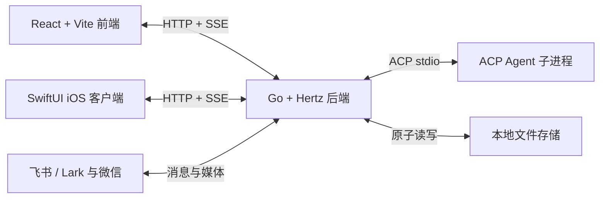

后端将 HTTP 处理、业务服务与本地持久化分层维护。包括 Eino 在内的所有 Agent 都通过同一套
ACP 会话与事件链路接入。

| 路径 | 作用 |
|---|---|
| `cmd/web` | Web 服务、API 路由、中间件和应用装配 |
| `cmd/eino-cli`、`einocli` | 内置的独立 Eino ACP Agent |
| `services` | Agent、任务、Graph、定时任务、工作区和统计业务逻辑 |
| `repository` | 本地数据持久化 |
| `types` | 共享领域类型与协议类型 |
| `pkg` | ACP、即时通讯、沙箱、日志和通用基础设施 |
| `web` | React 前端 |
| `ios` | 面向个人局域网使用的原生 SwiftUI 客户端（Sophia） |
| `skill/workflow` | 供编程 Agent 使用的 CLI 工作流 Skill |

## 工作流 Skill

Quartet 可以为受支持的编程 Agent 安装工作流管理 Skill：

```bash
make install-skill
```

该命令会构建 `quartet-cli`，默认安装到 `~/.local/bin`，并通过 `skills` CLI 注册
`quartet-workflow` Skill。该 Skill 可以在独立的 Agent 工作流库中创建、列出、查看、更新、
删除和校验工作流。用户手工编排的工作流对 CLI 保持只读。

## 开发

```bash
make build-all       # 构建所有 Go 应用
make build-frontend  # 类型检查并构建 React 应用
make test-ios        # 在 macOS 上无签名构建 iOS Simulator 目标
make test-web        # 运行前端组件测试
make e2e             # 运行 Playwright 端到端测试
make test            # 运行 Go 构建、前端测试和端到端测试
go test ./...        # 运行 Go 测试
```

也可以在 `web/` 目录中使用前端命令：

```bash
npm run dev
npm run build
npm run lint
npm test
```

## 参与贡献

欢迎提交 Issue 和 Pull Request。提交修改前，请遵循现有的服务分层，并运行与所改代码相关的
检查。

## 开源协议

Quartet 使用 [Apache License 2.0](LICENSE) 开源。
